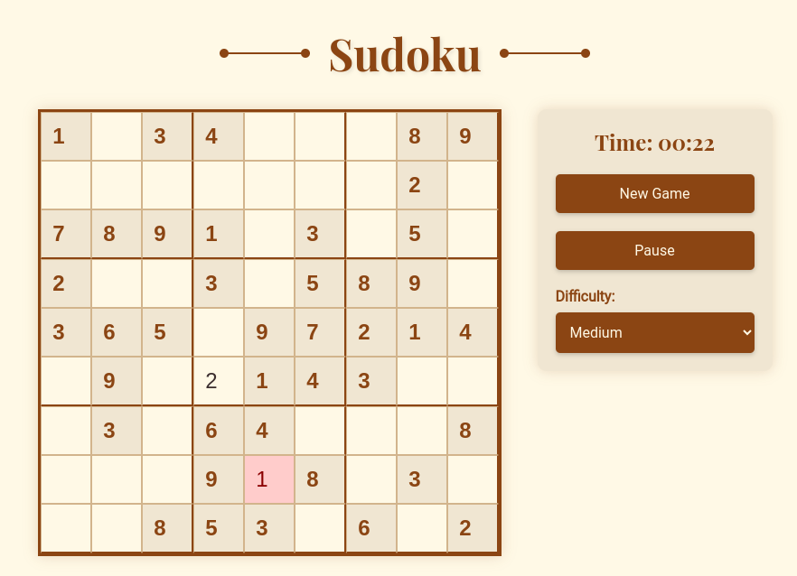

# Sudoku Elegance

Sudoku Elegance is a classic Sudoku game implementation with a rich, elegant user interface. Built with React, this game offers a sophisticated gaming experience with features like difficulty levels, timer, and immediate feedback on moves.



## Features

- Elegant, classical-themed user interface
- Three difficulty levels: Easy, Medium, and Hard
- Game timer
- Immediate feedback on correct/incorrect moves
- Pause and resume functionality
- Responsive design

## Getting Started

### Prerequisites

- Node.js (v14 or later recommended)
- npm (comes with Node.js)

### Installation

1. Clone the repository:
   ```
   git clone https://github.com/fathiyul/sudoku-elegance.git
   ```

2. Navigate to the project directory:
   ```
   cd sudoku-elegance
   ```

3. Install dependencies:
   ```
   npm install
   ```

4. Start the development server:
   ```
   npm start
   ```

5. Open [http://localhost:3000](http://localhost:3000) to view the game in your browser.

## How to Play

1. Select a difficulty level from the dropdown menu.
2. Click on a cell to select it.
3. Enter a number from 1 to 9.
4. The cell will turn red if the number is incorrect.
5. Complete the entire grid with correct numbers to win the game.

## Contributing

Contributions are welcome! Please feel free to submit a Pull Request.

## License

This project is licensed under the MIT License - see the [LICENSE](LICENSE) file for details.