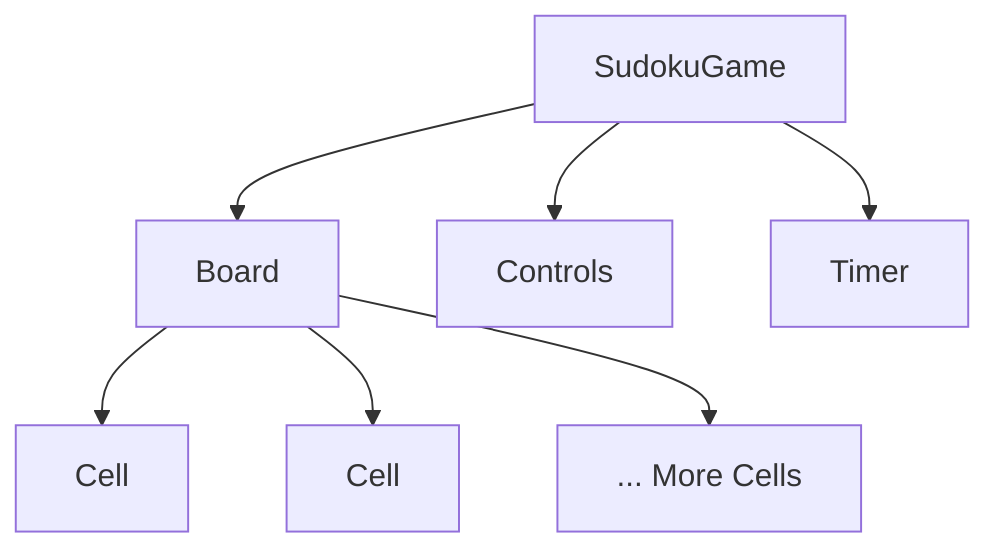

Planning your component structure. This is a crucial step in React development as it helps organize your code and makes the development process smoother.

For our Sudoku game, we'll plan a component structure that breaks down the UI and functionality into manageable parts. Here's a proposed structure:

1. SudokuGame (Main component)
   - This will be the top-level component that manages the game state and renders other components.

2. Board
   - Represents the entire 9x9 Sudoku grid.
   - Will contain 9x9 Cell components.

3. Cell
   - Represents a single cell in the Sudoku grid.
   - Handles user input for a specific cell.

4. Controls
   - Contains buttons and options for game control (e.g., "New Game", "Check", "Solve").

5. Timer (optional)
   - Displays the time elapsed since the game started.

Here's a visual representation of how these components might be structured:

This structure allows for a clear separation of concerns:

- SudokuGame manages the overall game state and logic.
- Board handles the rendering of the entire grid.
- Cell manages the state and input for individual cells.
- Controls provides user interface for game actions.
- Timer (if implemented) tracks and displays game duration.

When implementing these components, you'll create separate files for each:

1. `src/components/SudokuGame.js`
2. `src/components/Board.js`
3. `src/components/Cell.js`
4. `src/components/Controls.js`
5. `src/components/Timer.js` (if you decide to implement it)

This structure allows for easier maintenance, testing, and potential reuse of components. For example, the Cell component could be reused in other grid-based games, and the Timer component could be used in various timed activities.

As you build your game, you might find that you need to adjust this structure or add additional components. That's perfectly normal in the development process.
